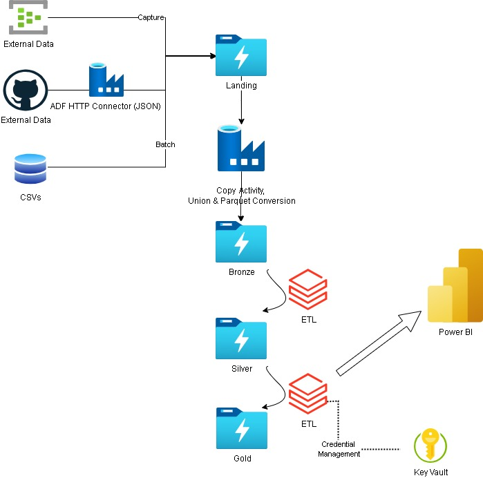
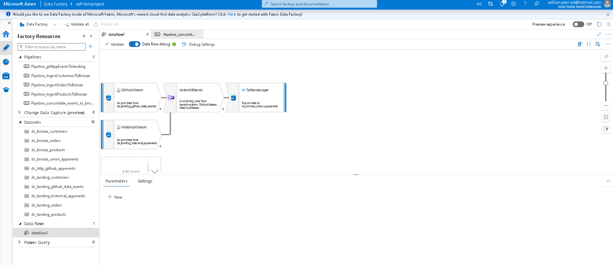
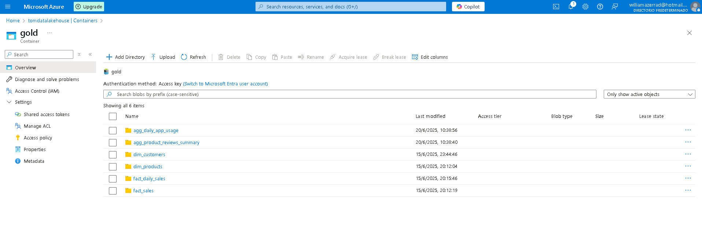
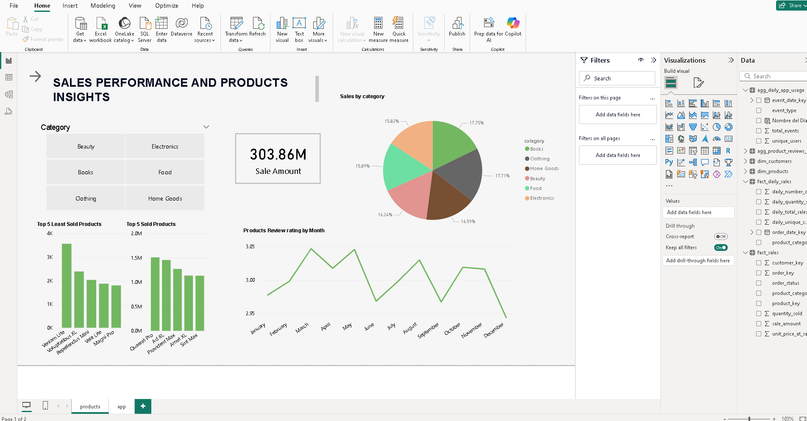
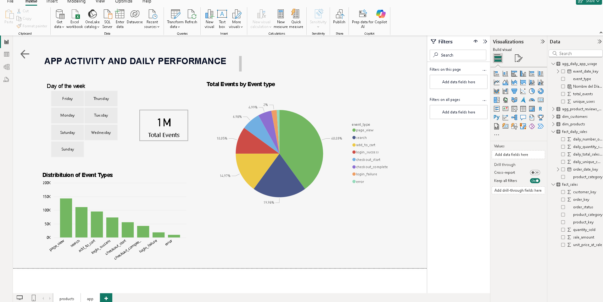

#  Data Lakehouse Project: E-commerce Data Analytics

> **Robust Data Lakehouse architecture on Azure for processing, transforming, and analyzing e-commerce data from multiple sources**

[](https://azure.microsoft.com)
[](https://azure.microsoft.com/services/event-hubs/)
[](https://azure.microsoft.com/services/data-factory/)
[](https://databricks.com)
[](https://powerbi.microsoft.com)

---

## **Project Overview**

This solution implements a **complete Data Lakehouse architecture** on Azure that processes e-commerce data from multiple sources and various formats. It leverages **Landing Zone** as the entry point, **Azure Data Lake Storage Gen2** for storage with Medallion architecture, **Azure Event Hubs** for real-time data ingestion, **Azure Data Factory** for orchestration, **Azure Databricks** for scalable ETL transformations, and **Power BI** for business visualization.

**🎯 Main objective:** Provide key insights into sales, products, customers, and application usage, democratizing access to clean and structured data.

> ** All project data is synthetically generated** using Python scripts with the Faker library to simulate realistic e-commerce datasets.

---

## 🗺️ **Architecture Overview**



### **Data Flow:**
```
Sources → Landing Zone → Bronze → Silver → Gold → Power BI
```

---

## ✨ **Key Features**

### **🌐 Multi-Source Data Approach**
| Type | Source | Description | Format |
|------|--------|-------------|---------|
| **Streaming** | Event Hubs | Real-time product reviews | Avro |
| **API Simulation** | GitHub | Application events | JSON → Parquet |
| **Batch** | CSV Files | Customers, products, orders | CSV |

### **🏗 Storage Zones**

#### ** Landing Zone**
- Initial temporary storage in ADLS Gen2
- Raw data before processing
- Entry point for all sources

#### ** Medallion Architecture**
<table>
<tr>
<td align="center" width="33%">

### **🥉 Bronze (Raw)**
- Immutable data as received
- Original formats preserved
- Avro, Parquet, CSV

</td>
<td align="center" width="33%">

### **🥈 Silver (Cleaned)**
- Cleaned and deduplicated data
- Schema enforcement
- Delta Lake format

</td>
<td align="center" width="33%">

### **🥇 Gold (Curated)**
- Aggregated and modeled data
- Dimensional format
- Optimized for analytics

</td>
</tr>
</table>

---

## 🛠️ **Technology Stack**

### **Azure Services**
- **Azure Data Lake Storage Gen2** → Centralized data storage
- **Azure Event Hubs** → Real-time data streaming
- **Azure Data Factory** → ETL orchestration and data flows
- **Azure Databricks** → Spark-based processing
- **Azure Key Vault** → Secure secret management

### **Data Formats & Frameworks**
- **Delta Lake** → ACID transactions on data lakes
- **Apache Avro** → Efficient serialization (streaming)
- **Apache Parquet** → Columnar storage format
- **CSV** → Standard batch data format

### **Programming & Tools**
- **Python + Faker** → Synthetic data generation
- **Spark SQL / PySpark** → Data transformation logic
- **Power BI** → Business intelligence and visualization
- **GitHub** → External source simulation

---

## 📊 **Data Pipelines**

### **Data Ingestion and Orchestration**

#### **1. Event Hubs with Capture**
- Real-time pipeline for **product reviews**
- Data sent via custom script
- Automatic **Capture** to Landing Zone in Avro format

#### **2. Azure Data Factory**
- **`app_events` Pipeline**: Specific Data Flow that:
  - Extracts data from GitHub (simulating API)
  - Joins with historical data in Landing Zone
  - Transforms and consolidates information
  - Saves to Bronze layer in Parquet format
- **Copy Pipelines**: Transfer batch data (CSV) and captures (Avro)

#### **3. Azure Databricks**
- Spark engines for complex transformations
- Bronze → Silver → Gold processing
- Final Delta tables generation

---

## 🔐 **Security**

- **Azure Key Vault** for credential management
- **Service Principals (OAuth2)** for ADLS Gen2 access
- Secure authentication in Databricks

---

##  **Implementation Guide**

### **📋 Prerequisites**
- Active Azure subscription
- Provisioned Azure resources: ADLS Gen2, Event Hubs, Data Factory, Databricks, Key Vault
- Service Principal with necessary permissions
- Secrets stored in Key Vault
- Power BI Desktop installed

### **⚙️ Step-by-Step Configuration**

<details>
<summary>🔧 1. Configure Azure Key Vault</summary>

- Store `client-id`, `client-secret`, `tenant-id` in Key Vault
- Create Secret Scope in Databricks (e.g., `tom-keyvault`)
</details>

<details>
<summary>📡 2. Configure Multi-Source Ingestion</summary>

**Event Hubs:**
- Create Event Hub for `product_reviews`
- Enable **Capture** → Landing container in ADLS Gen2
- Use script `send_review_data.py` for sample data

**Azure Data Factory:**
- Create Linked Services for ADLS Gen2, GitHub, Event Hubs
- Implement Data Flow for `app_events` pipeline
- Configure copy pipelines for batch and captures
</details>

<details>
<summary> 3. Configure Databricks</summary>

- Create Azure Databricks cluster
- Import notebooks: `01_bronze_to_silver.py`, `02_silver_to_gold_modeling.py`
- Execute sequentially for transformations
</details>

<details>
<summary> 4. Connect Power BI</summary>

- Open Power BI Desktop
- "Get Data" → "Azure Data Lake Storage Gen2"
- Direct URL to Gold tables (e.g., `https://tomdatalakehouse.dfs.core.windows.net/gold/fact_sales/`)
- Authenticate with Account Key
- Filter ".parquet" extension and combine content
- Load all necessary Gold tables
</details>

---

## 📊 **Results and Visualizations**

### **🔄 Data Pipeline Flow in Databricks**


### **Gold Layer Tables in ADLS Gen2**


### **📈 Power BI Dashboards**

#### **💰 Sales Performance**


#### **📱 Application Activity**


---

## 🎯 **Project Benefits**

- **📊 Complete Integration** → Streaming, API, and batch data
- **🔄 Single Source of Truth** → Clean and transformed data
- **⚡ Advanced Analytics** → Data-driven decision making
- **🔒 Robust Security** → Key Vault credential management
- **📈 Scalability** → Azure-native architecture

---

## 📞 **Contact**

**Braulio Tomas Fernandez Trejo**

[](https://linkedin.com/in/your-profile)
[](https://github.com/Tomcodedays)

---

<div align="center">

**⭐ If you find this project useful, give it a star! ⭐**

</div>
