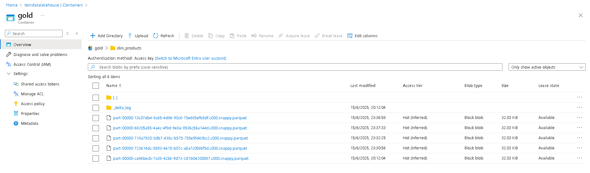

# 🚀 Data Lakehouse Project: E-commerce Data Analytics

---

## 📄 Overview

This project implements a robust **Data Lakehouse architecture** on Azure, designed to process, transform, and analyze e-commerce data originating from **multiple sources and various formats**. The solution leverages a **Landing Zone** as the initial entry point for raw data, **Azure Data Lake Storage Gen2 (ADLS Gen2)** as the central storage for the Medallion layers, **Azure Event Hubs** for real-time data ingestion, **Azure Data Factory (ADF)** for orchestration and ingestion, **Azure Databricks** for scalable data transformations (ETL), and **Power BI** for business visualization and analytics. The main objective is to provide key insights into sales, products, customers, and application usage, democratizing access to clean and structured data. **All project data is synthetically generated using Python scripts, specifically leveraging the Faker library to simulate realistic e-commerce datasets.**

---

## ✨ Project Overview

This project showcases a robust **Data Lakehouse architecture** built on **Azure**, designed to process, transform, and analyze e-commerce data from **diverse sources and formats**. Our primary goal is to provide **key business insights** into sales, products, customer behavior, and application usage, democratizing access to clean, structured data.

**All project data is synthetically generated using Python scripts with the Faker library to simulate realistic e-commerce datasets**, ensuring a comprehensive and reproducible environment.

---

## 🎯 Why This Project?

In today's data-driven world, e-commerce businesses need a flexible and scalable solution to handle vast amounts of data from various touchpoints. This Data Lakehouse addresses challenges such as:

* Integrating **real-time streaming, API, and batch data**.
* Providing a **single source of truth** with clean, transformed data.
* Enabling **advanced analytics and reporting** for informed decision-making.

---

## 🗺️ Architecture Diagram

Below is a high-level overview of the Data Lakehouse architecture, illustrating the data flow from ingestion to consumption.

## ✨ Key Features

* **Multi-Source Data Approach:** The project handles and orchestrates data ingestion from three main types of sources:
    1.  **Streaming (Product Reviews):** `product_reviews` data sent in real-time to Azure Event Hubs.
    2.  **API Simulation (Application Events):** `app_events` data extracted from an external source (simulating an API via GitHub).
    3.  **Traditional Batch (Customers, Products, Orders):** Structured `customers`, `products`, and `orders` data in CSV format.

* **Storage Zones:**
    * **Landing Zone:** Initial temporary storage area in ADLS Gen2 for all raw incoming data, prior to any processing or movement to the medallion layers.
    * **Data Layers (Bronze, Silver, Gold - Medallion Architecture):**
        * **Bronze (Raw):** Immutable storage of raw data as received from the Landing Zone. Original formats such as **Avro** (for streaming) and **Parquet** (for application events) are maintained, along with **CSV** for batch data.
        * **Silver (Cleaned/Refined):** Cleaned, deduplicated, and transformed data with schema enforced. Data is consolidated into **Delta Lake** format.
        * **Gold (Curated/Aggregated):** Aggregated and modeled data in a dimensional format (`fact_sales`, `dim_products`, `dim_customers`, etc.) optimized for business analytics. Data is maintained in **Delta Lake** format.

* **Storage Technology:** All layers reside in **Azure Data Lake Storage Gen2 (ADLS Gen2)**, leveraging its scalability and hierarchical namespace capabilities. **Delta Lake** format is used for the Silver and Gold layers, ensuring ACID transactions, schema evolution, and support for `MERGE` operations.

* **Data Ingestion and Orchestration (ELT/ETL):**
    * **Azure Event Hubs with Capture:** Implementation of a real-time data ingestion pipeline for **product reviews (`product_reviews`)**. Data is sent to Azure Event Hubs via a custom script and then, using the **Capture** feature, is automatically dumped and persisted to the **Landing Zone** (ADLS Gen2) in **Avro** format, ready for further processing.
    * **Azure Data Factory (ADF):** Used to orchestrate and automate data pipelines.
        * **`app_events` Pipeline:** A specific **Data Flow** within ADF is responsible for:
            * Extracting `app_events` data, simulating an API via a file on **GitHub** (using an HTTP Linked Service).
            * Joining this data (JSON) with existing historical data in the **Landing Zone**.
            * Transforming and consolidating the information.
            * Finally, saving the resulting data in **Parquet** format to the **Bronze** layer.
        * **Batch Data Ingestion:** ADF copy pipelines transfer structured batch data (CSV) for `customers`, `products`, and `orders` from the Landing Zone to the **Bronze** layer.
    * **Azure Databricks:** Spark compute engines for complex transformations between the Bronze, Silver, and Gold layers, generating the final Delta tables.

* **Secure Authentication:** ADLS Gen2 access is configured using **Azure Key Vault** and **Service Principals (OAuth2)** for secure credential management in Databricks.

* **Visualization and Analytics:**
    * **Power BI:** Direct connection to the Gold layer Delta tables in ADLS Gen2 for creating interactive dashboards. This direct connection leverages Power BI's native ability to read Delta Lake, optimizing latency and compute costs for BI queries.

---

## 🛠️ Technologies Used

This project utilizes a comprehensive suite of Azure services and data technologies:

* **Azure Core:**
    * **Azure Data Lake Storage Gen2 (ADLS Gen2):** Centralized data storage.
    * **Azure Event Hubs:** Real-time data streaming.
    * **Azure Data Factory (ADF):** ETL orchestration and data flows.
    * **Azure Databricks:** Spark-based data processing and analytics.
    * **Azure Key Vault:** Secure secret management.
* **Data Formats & Frameworks:**
    * **Delta Lake:** Open-source storage layer for ACID transactions on data lakes.
    * **Apache Avro:** Efficient data serialization format (for streaming).
    * **Apache Parquet:** Columnar storage format (for `app_events`).
    * **CSV:** Standard batch data format.
* **Programming & Tools:**
    * **Python (with Faker library):** For synthetic data generation and custom scripts.
    * **Spark SQL / PySpark:** For data transformation logic in Databricks.
    * **Power BI:** Business intelligence and data visualization.
    * **GitHub:** Used as an external source for API simulation data.

---

## 🚀 How to Run the Project

### Prerequisites

* Active Azure subscription.
* Provisioned Azure resources: Azure Data Lake Storage Gen2, Azure Event Hubs, Azure Data Factory, Azure Databricks Workspace, Azure Key Vault.
* An Azure AD Service Principal with necessary permissions for ADF (Storage Blob Data Contributor) and Databricks (Storage Blob Data Reader/Contributor).
* Service Principal secrets (Client ID, Client Secret, Tenant ID) stored in Azure Key Vault.
* Power BI Desktop installed.

### Steps

1.  **Configure Azure Key Vault and Secrets:**
    * Store your Service Principal's `client-id`, `client-secret`, and `tenant-id` in Azure Key Vault.
    * Create a Secret Scope in Databricks to access these secrets (e.g., `tom-keyvault`).

2.  **Configure Multi-Source Data Ingestion to Landing Zone:**
    * **Event Hubs:**
        * Create an Event Hub (e.g., for `product_reviews`).
        * Enable the **Capture** feature to automatically dump messages to the **Landing** container of your ADLS Gen2 in **Avro** format.
        * (Optional) Use a script (e.g., `send_review_data.py`) to send sample data to your Event Hub.
    * **Azure Data Factory:**
        * Create Linked Services for ADLS Gen2, GitHub, and Event Hubs (if needed for monitoring or triggers).
        * **Implement the `app_events` Data Flow pipeline:** Configure the Data Flow to read from GitHub, join with historical data in **Landing**, and write in **Parquet** format to the **Bronze** layer in ADLS Gen2.
        * Implement copy pipelines to transfer batch files (CSV) and Event Hubs Capture dumps (Avro) from the **Landing Zone** to the **Bronze** layer.

3.  **Configure Databricks Cluster:**
    * Create an Azure Databricks cluster.

4.  **Execute Databricks Notebooks:**
    * Import the notebooks (`01_bronze_to_silver.py`, `02_silver_to_gold_modeling.py`) into your Databricks workspace.
    * Attach them to your configured cluster and run them sequentially to transform data from Bronze to Silver, and then from Silver to Gold Delta tables.

5.  **Connect Power BI:**
    * Open Power BI Desktop.
    * "Get Data" -> "Azure Data Lake Storage Gen2".
    * For each Gold table, enter the direct URL of its Delta folder (e.g., `https://tomdatalakehouse.dfs.core.windows.net/gold/fact_sales/`).
    * Authenticate using your Storage Account's **Account Key**.
    * In the Power Query Editor, filter the ".parquet" extension and combine the content of the "Content" column to load the Delta table.
    * Load all necessary Gold tables (fact_sales, dim_products, dim_customers, etc.).

6.  **Build Power BI Reports:**
    * Once the tables are loaded, you can establish relationships between them and start creating interactive visualizations.
---

## 📸 Visuals & Dashboards

Below are key visuals illustrating the project's development and achievements:

* **Screenshot 1: Data Pipeline Flow in Databricks.**

* **Screenshot 2: Gold Layer Tables in ADLS Gen2.**

* **Screenshot 3: Power BI Dashboard - Sales Performance.**

## 📧 Contact

* **Braulio Tomas Fernandez Trejo**
* **LinkedIn:** [Link to your LinkedIn Profile]
* **GitHub:** [https://github.com/Tomcodedays]
